# Project-Final: Techcareer.net Frontend Clone

This project is a frontend clone of the [Techcareer.net](https://www.techcareer.net) website, replicating its design and functionality using HTML, CSS, and JavaScript.

## Project Structure

- **index.html**: The homepage of the clone, where users can view an overview of the site.
- **events.html**: A page that lists all events.

## Functionality

- The "Tüm Etkinlikleri Gör" button on the `index.html` page navigates users to the `events.html` page where they can see a full list of events.

## Screenshots

1. **Homepage (`index.html`)**

   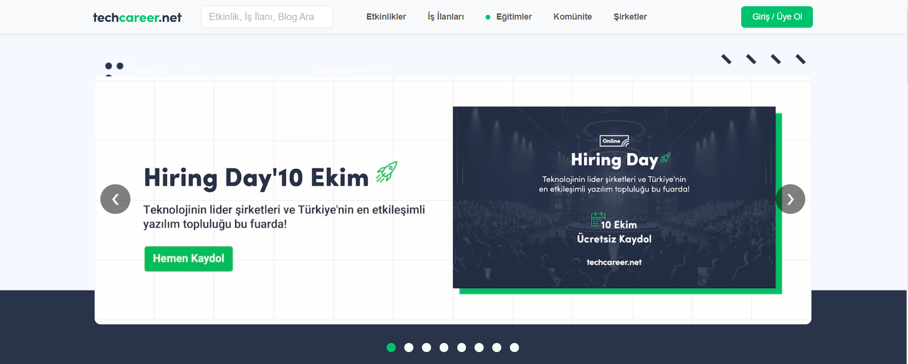
   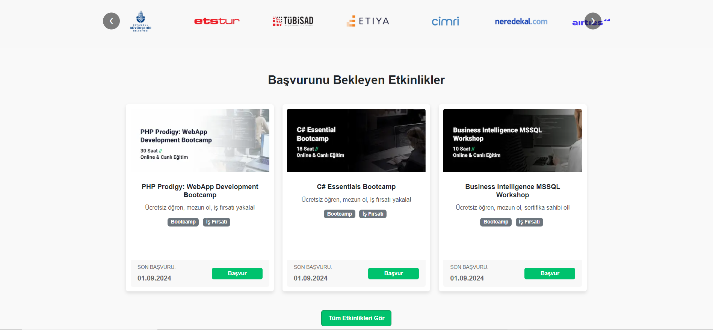
   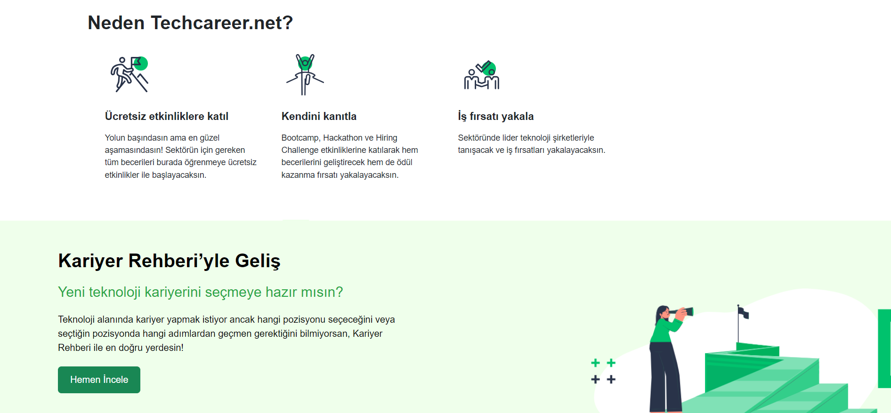
   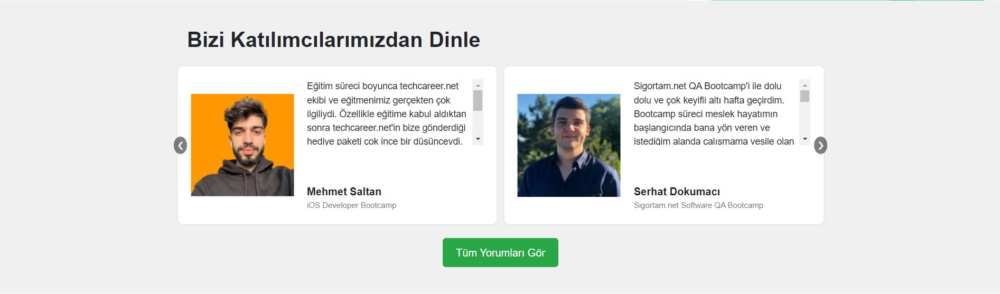
   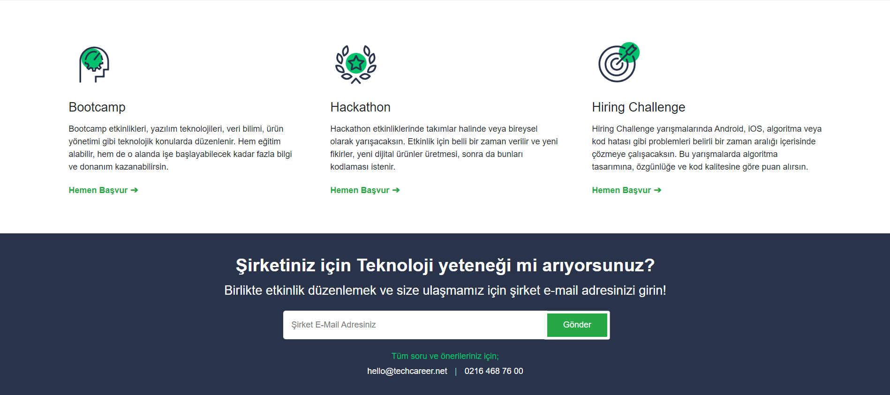
   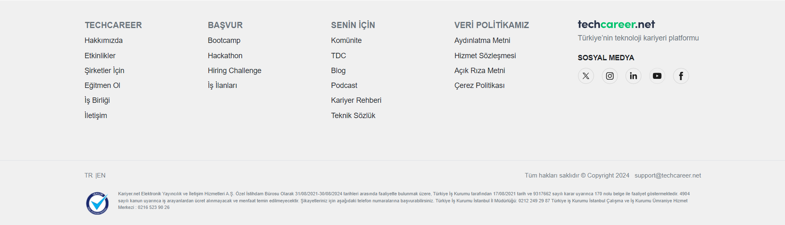

2. **Events Page (`events.html`)**

   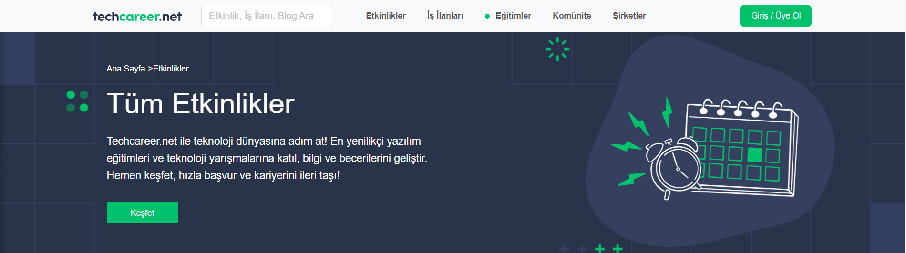
   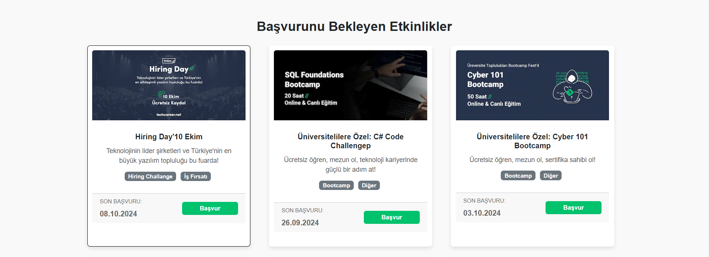
   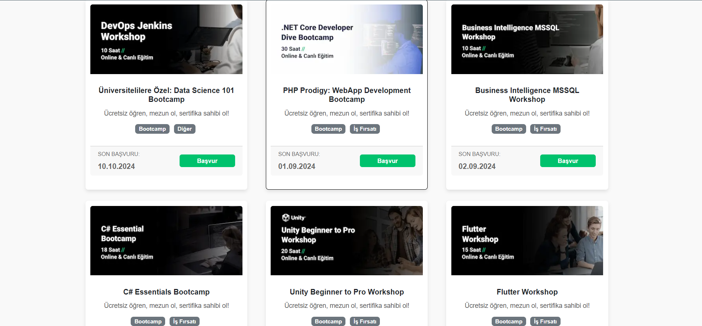
   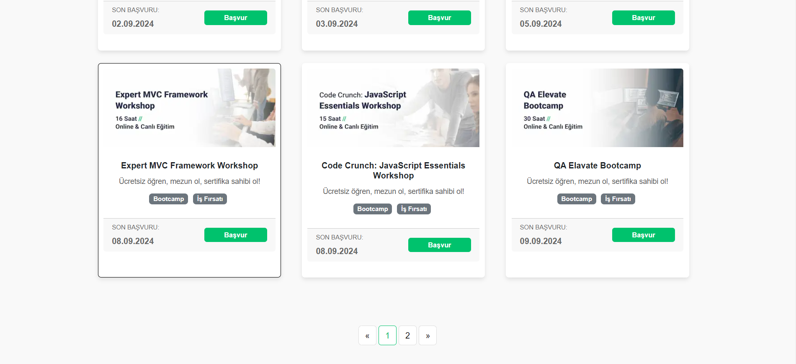
   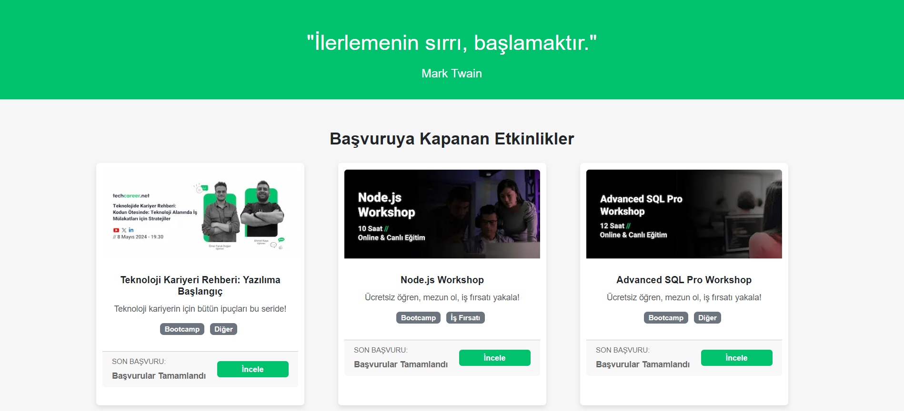
   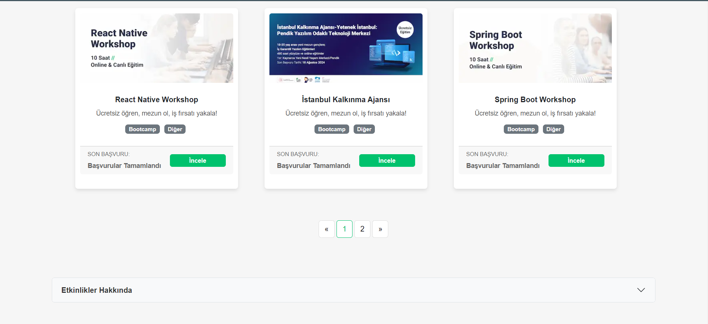
   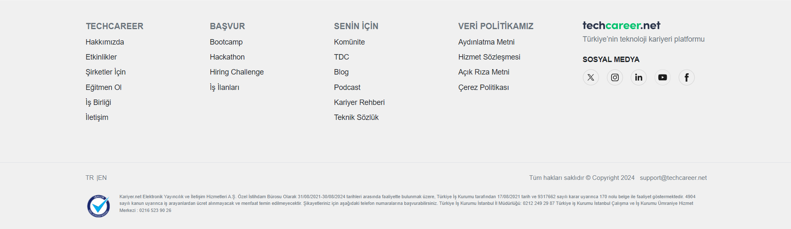

## Usage

- Open `index.html` in your web browser to view the homepage.
- Click on "Tüm Etkinlikleri Gör" to navigate to the `events.html` page.

## Technologies Used

- HTML
- CSS
- JavaScript
